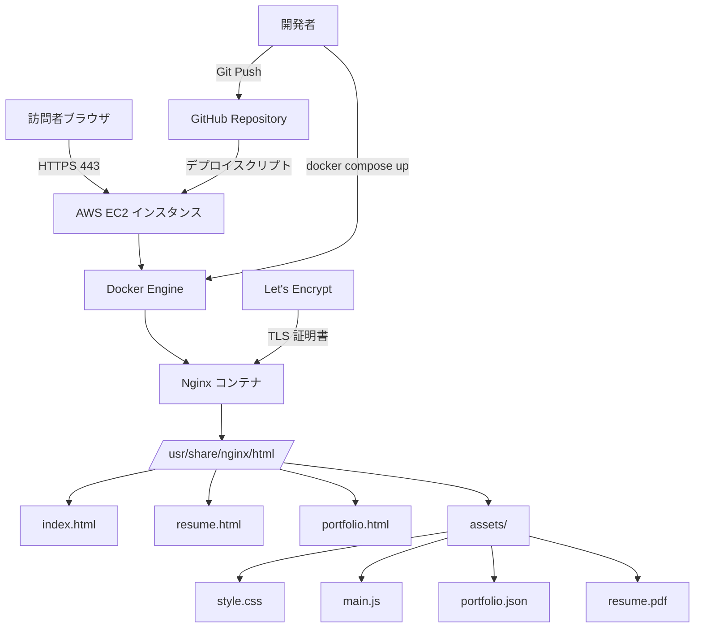

# Resume Website

## 概要

Resume Website は、開発者自身のレジュメおよびポートフォリオを公開する静的ウェブサイトプロジェクトです。AWS EC2 インスタンス上に Docker と Nginx を用いてデプロイし、HTTPS による安全なアクセスを提供します。本プロジェクトの主な目的は、ウェブサーバのセットアップ、セキュリティ対策、デプロイフローの構築を実践的に学ぶことです。

## 特徴

- **サブドメイン対応**: `resume.kskaiko-soft.dev` および `portfolio.kskaiko-soft.dev` からアクセス可能
- **レスポンシブデザイン**: モバイル・タブレット・デスクトップに対応した共通レイアウト
- **動的コンテンツ読み込み**: JSON ファイルからポートフォリオ一覧を動的に生成
- **PDF ダウンロード**: レジュメの PDF 版を提供
- **HTTPS 対応**: Let's Encrypt による TLS 証明書で安全な通信を実現
- **Docker コンテナ化**: 環境の再現性と可搬性を確保
- **共通パーシャル**: ヘッダー・フッターを分離し、保守性を向上

## このプロジェクトを通して学べること・習得できること

### 1. ウェブサーバの構築とデプロイ
- **Nginx の設定**: リバースプロキシ、静的ファイル配信、セキュリティヘッダーの設定
- **Docker 活用**: `Dockerfile` と [`docker-compose.yml`](docker-compose.yml) による環境のコンテナ化
- **EC2 インスタンス管理**: AWS 上でのサーバセットアップと運用

### 2. セキュリティ対策
- **HTTPS/TLS 終端**: Let's Encrypt と Certbot による証明書取得・更新の自動化
- **セキュリティヘッダー**: `X-Content-Type-Options`, `X-Frame-Options`, `X-XSS-Protection` の適用
- **TLS プロトコル設定**: TLSv1.2/1.3 の有効化と安全な暗号スイートの選択

### 3. フロントエンド設計とモジュール化
- **共通レイアウトパターン**: [`public/partials/header.html`](public/partials/header.html) と [`public/partials/footer.html`](public/partials/footer.html) によるテンプレート分離
- **Vanilla JavaScript による DOM 操作**: [`public/assets/main.js`](public/assets/main.js) での非同期データ取得とレンダリング
- **JSON データ駆動**: [`public/assets/portfolio.json`](public/assets/portfolio.json) を用いた動的コンテンツ生成

### 4. UML とシステム設計
- **ユースケース図**: 訪問者とサイトオーナーのインタラクションを整理（[`diagrams/usecase.pu`](diagrams/usecase.pu)）
- **アーキテクチャ図**: システム全体の構成を可視化（[`diagrams/arch.pu`](diagrams/arch.pu)）
- **シーケンス図**: リクエスト/レスポンスの流れを明確化（[`diagrams/sequence.pu`](diagrams/sequence.pu)）
- **コンポーネント図**: 各モジュールの依存関係を整理（[`diagrams/component.pu`](diagrams/component.pu)）
- **クラス図**: フロントエンドの概念的なクラス構造を設計（[`diagrams/class.pu`](diagrams/class.pu)）

### 5. インフラストラクチャとデプロイフロー
- **CI/CD の基礎**: ローカル → 本番環境への単一コマンドデプロイスクリプトの整備
- **ログ管理**: [`logs/nginx`](logs/nginx) へのアクセスログ・エラーログ出力と `.gitignore` 設定
- **ヘルスチェック**: Docker Compose のヘルスチェック機能でコンテナの稼働監視

### 6. パフォーマンス最適化
- **静的アセットのキャッシュ**: [`nginx.conf`](nginx.conf) で `expires` と `Cache-Control` ヘッダーを設定
- **Gzip 圧縮**: CSS/JS の転送量削減（設定可能）
- **レスポンシブ最適化**: [`public/assets/style.css`](public/assets/style.css) のメディアクエリによるモバイル対応

### 7. プロジェクト管理とドキュメンテーション
- **要件定義**: [`requirement/requirements.md`](requirement/requirements.md) での機能・非機能要件の整理
- **タスク管理**: [`requirement/task.md`](requirement/task.md) によるチェックリスト形式の進捗管理
- **PlantUML によるドキュメント化**: コードとして管理可能な設計図の作成

### システムアーキテクチャ概念図



## 必要条件

- **Docker**: 20.10 以上
- **Docker Compose**: 2.x 以上
- **AWS EC2**: Ubuntu 22.04 LTS または Amazon Linux 2023
- **ドメイン**: DNS 設定が完了していること（例: `resume.kskaiko-soft.dev`）
- **Let's Encrypt Certbot**: TLS 証明書取得用（EC2 上で実行）

## インストール手順

### 1. リポジトリのクローン

```bash
git clone https://github.com/yourusername/ResumeWebsite.git
cd ResumeWebsite
```

### 2. 初期セットアップスクリプトの実行（オプション）

```bash
bash ini.sh
```

### 3. レジュメ PDF の配置

[`public/assets/resume.pdf`](public/assets/resume.pdf) に実際の PDF ファイルを配置してください。

### 4. Docker イメージのビルドと起動

```bash
docker compose up --build -d
```

### 5. TLS 証明書の取得（EC2 上で実行）

```bash
sudo certbot certonly --webroot -w /var/www/certbot \
  -d resume.kskaiko-soft.dev \
  -d portfolio.kskaiko-soft.dev
```

証明書取得後、[`nginx.conf`](nginx.conf) の SSL パスを確認し、コンテナを再起動してください。

```bash
docker compose restart
```

## 使用方法

### ローカル開発環境

1. [`docker-compose.yml`](docker-compose.yml) でポート 80/443 をバインド
2. ブラウザで `http://localhost` にアクセス
3. ファイル編集後、コンテナを再起動して変更を反映

```bash
docker compose restart
```

### 本番環境（EC2）

1. DNS で `resume.kskaiko-soft.dev` と `portfolio.kskaiko-soft.dev` を EC2 の Elastic IP に設定
2. セキュリティグループで 80/443 ポートを開放
3. `docker compose up -d` でサービスを起動
4. `https://resume.kskaiko-soft.dev` でアクセス確認

## 機能一覧

- **ホームページ**: 自己紹介とサイト概要の表示（[`public/index.html`](public/index.html)）
- **レジュメページ**: プロフィール、スキル、経験を掲載（[`public/resume.html`](public/resume.html)）
- **ポートフォリオ一覧**: JSON から動的に生成されるプロジェクトカード（[`public/portfolio.html`](public/portfolio.html)）
- **PDF ダウンロード**: レジュメの PDF 版を提供
- **共通ナビゲーション**: 全ページで統一されたヘッダー・フッター
- **404 エラーページ**: カスタムエラーページ（[`public/404.html`](public/404.html)）
- **レスポンシブデザイン**: モバイル・タブレット対応

## 技術スタック

### フロントエンド
- **HTML5**: セマンティックマークアップ
- **CSS3**: カスタムプロパティ、Grid、Flexbox
- **Vanilla JavaScript**: Fetch API、DOM 操作、非同期処理

### バックエンド・インフラ
- **Nginx**: 静的ファイル配信、リバースプロキシ、TLS 終端
- **Docker**: コンテナ化
- **Docker Compose**: マルチコンテナ管理
- **AWS EC2**: 本番環境ホスティング
- **Let's Encrypt**: TLS 証明書の無料提供

### ツール
- **PlantUML**: UML 図の作成
- **Git**: バージョン管理
- **Bash**: デプロイ・初期化スクリプト

## 追加資料

- **要件定義**: [`requirement/requirements.md`](requirement/requirements.md)
- **タスクリスト**: [`requirement/task.md`](requirement/task.md)
- **UML 図**:
  - [ユースケース図](diagrams/usecase.pu)
  - [アクティビティ図](diagrams/activity.pu)
  - [シーケンス図](diagrams/sequence.pu)
  - [コンポーネント図](diagrams/component.pu)
  - [クラス図](diagrams/class.pu)
  - [アーキテクチャ図](diagrams/arch.pu)

PlantUML 図を PNG に変換するには以下のコマンドを使用してください:

```bash
plantuml diagrams/*.pu
```

## 貢献方法

プロジェクトへの貢献を歓迎します！以下の手順に従ってください:

1. **Issue の作成**: バグ報告や新機能の提案は Issue で行ってください
2. **Fork**: リポジトリをフォークして、ローカルで作業を開始
3. **ブランチ作成**: `feature/your-feature` や `fix/your-bugfix` のような命名規則でブランチを作成
4. **変更を加える**: コードを編集し、コミットメッセージは明確に記述
5. **Pull Request**: フォーク元のリポジトリに PR を作成し、変更内容を説明

### コントリビューションガイドライン

- コードスタイル: Prettier および ESLint の設定に従う（今後追加予定）
- コミットメッセージ: `feat:`, `fix:`, `docs:` などのプレフィックスを使用
- テスト: 新機能には適切なテストを追加（今後検討）

## ライセンス

このプロジェクトは [MIT ライセンス](LICENSE) の下で公開されています。自由に使用・改変・再配布が可能です。

---

**作成者**: Keisuke Aiko  
**リポジトリ**: [https://github.com/yourusername/ResumeWebsite](https://github.com/yourusername/ResumeWebsite)  
**サイト**: [https://resume.kskaiko-soft.dev](https://resume.kskaiko-soft.dev)