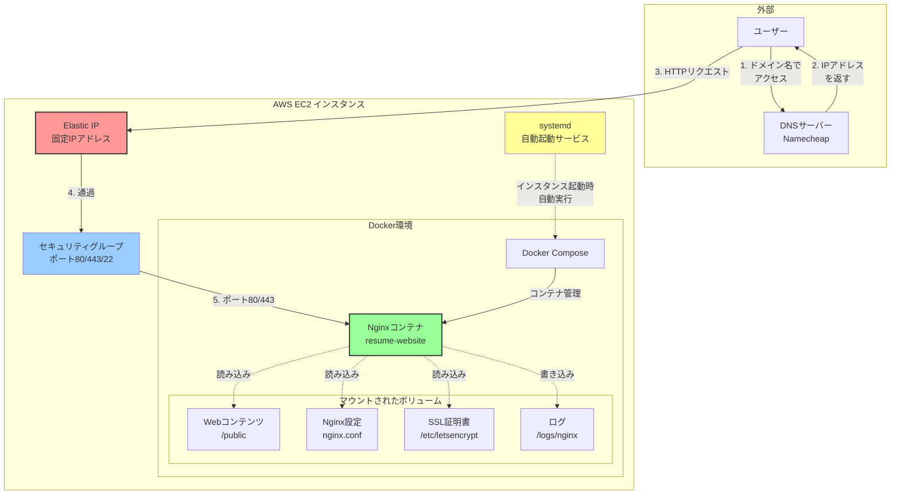

# AWS無料枠終了後にインスタンスが起動しない？Docker上のNginxを復旧する手順

## この記事について

AWSの無料枠が終了してインスタンスが停止した後、有料プランにアップグレードして再起動したものの、Webサイトが表示されなくなった経験はありませんか？

本記事では、**Docker上でNginxを動かしていた場合の復旧手順**を、実際のトラブルシューティングの流れに沿って解説します。「インスタンスは起動しているのにサイトが見れない」という状況に遭遇した方の参考になれば幸いです。

## 前提知識

- AWSのEC2インスタンスの基本的な操作ができること
- Dockerの基礎知識（docker-compose の使い方）
- SSH接続の経験があること
- DNSの基本的な仕組みを理解していること

## Context：問題の背景

### 発生した状況

1. AWS無料枠が終了し、EC2インスタンスが自動停止
2. 有料プランにアップグレードしてインスタンスを再起動
3. インスタンスのステータスは「running」だが、Webサイトにアクセスできない
4. DNSレコードも新しいIPアドレスに更新済み

### なぜこの問題が起きるのか

EC2インスタンスを停止→起動すると、以下の変化が発生します：

- **パブリックIPアドレスが変更される**（Elastic IP未使用の場合）
- インスタンス自体は無事だが、**Dockerコンテナは自動起動しない**
- システムサービスとして登録されていないDockerコンテナは手動起動が必要

## Core Concept：トラブルシューティングの考え方

問題解決は以下の順序で進めます：

```
1. インスタンス自体の状態確認
   ↓
2. ネットワーク設定の確認（IPアドレス、DNS、セキュリティグループ）
   ↓
3. Webサーバーの状態確認
   ↓
4. 原因特定と復旧
```

## 実装例：段階的なトラブルシューティング

### Step 1: インスタンスの状態確認

まず、EC2コンソールでインスタンスの状態を確認します。

```bash
# ステータスチェック
# EC2コンソール → インスタンス選択 → 「ステータスチェック」タブ
# 「2/2のチェックに合格しました」と表示されていればOK
```

システムログも確認します：

```bash
# EC2コンソールでの操作
# インスタンス選択 → アクション → モニタリングとトラブルシューティング 
# → システムログを取得
```

ログの最後に以下のような表示があれば、起動は完了しています：

```
Cloud-init v. X.X.X finished at [日時]
Ubuntu 22.04.X LTS [ホスト名] ttyS0
```

### Step 2: ネットワーク設定の確認

#### パブリックIPアドレスの変更確認

```bash
# EC2コンソールでインスタンスの詳細を確認
# 「パブリックIPv4アドレス」をコピー
```

**重要**: インスタンスを停止→起動すると、パブリックIPは必ず変わります（Elastic IP未使用時）。

#### DNS設定の更新

Namecheapなどのドメインレジストラで、Aレコードを新しいIPアドレスに更新します：

```
1. Namecheapにログイン
2. ドメイン管理 → Advanced DNS
3. Aレコードの値を新しいIPアドレスに変更
4. 保存（反映には数分〜数時間かかる）
```

DNS反映を確認：

```bash
# ローカルマシンで実行
nslookup yourdomain.com

# または
dig yourdomain.com
```

#### セキュリティグループの確認

セキュリティグループの設定は通常、インスタンス停止→起動では変わりませんが、念のため確認します：

```bash
# EC2コンソールでの確認
# インスタンス選択 → セキュリティタブ → セキュリティグループ名をクリック

# 必要なインバウンドルール
# - HTTP (80): 0.0.0.0/0
# - HTTPS (443): 0.0.0.0/0
# - SSH (22): 0.0.0.0/0 または特定のIP
```

### Step 3: SSH接続とWebサーバー確認

```bash
# SSH接続
ssh -i your-key.pem ubuntu@新しいIPアドレス
```

接続できたら、Webサーバーの状態を確認します：

```bash
# Nginxの確認（システムサービスとしてインストールされている場合）
sudo systemctl status nginx
```

もし `Unit nginx.service could not be found.` と表示される場合、以下を確認します：

```bash
# Apacheの確認
sudo systemctl status apache2

# ポート80/443を使用しているプロセスを確認
sudo lsof -i :80
sudo lsof -i :443
```

### Step 4: Docker上のNginxを発見・復旧

#### プロジェクトファイルの確認

システムサービスとしてWebサーバーが見つからない場合、Dockerで動かしていた可能性があります：

```bash
# プロジェクトフォルダにnginx.confがあるか確認
ls -la ~/your-project/nginx.conf

# docker-compose.ymlの確認
ls -la ~/your-project/docker-compose.yml
cat ~/your-project/docker-compose.yml
```

#### Dockerコンテナの状態確認

```bash
# 停止中も含めて全コンテナを表示
sudo docker ps -a

# Dockerイメージの確認
sudo docker images
```

#### コンテナの起動

プロジェクトフォルダに移動して、Docker Composeでコンテナを起動します：

```bash
# プロジェクトフォルダに移動
cd ~/your-project

# コンテナをバックグラウンドで起動
sudo docker-compose up -d
```

#### 起動確認

```bash
# コンテナが起動しているか確認
sudo docker ps

# 期待される出力例：
# CONTAINER ID   IMAGE              STATUS          PORTS                                      NAMES
# abc123def456   resume-website     Up 2 minutes    0.0.0.0:80->80/tcp, 0.0.0.0:443->443/tcp   resume-website
```

**確認ポイント**：
- `STATUS` が `Up` になっている → ✅ 正常起動
- `PORTS` に `0.0.0.0:80->80/tcp` が表示されている → ✅ ポート80が開いている

ログを確認する場合：

```bash
# リアルタイムでログを表示
sudo docker-compose logs -f

# 特定のコンテナのログのみ表示
sudo docker logs resume-website
```

### Step 5: ブラウザでアクセス確認

```bash
# IPアドレスで直接アクセス
http://新しいIPアドレス

# DNS反映後はドメイン名でアクセス
http://yourdomain.com
```

## 落とし穴・注意点

### 1. Elastic IPを使わないとIPが毎回変わる

インスタンスを停止→起動するたびにパブリックIPが変わるため、以下の対策を推奨します：

```bash
# Elastic IPの割り当て（EC2コンソール）
# 1. 左メニュー「Elastic IP」
# 2. 「Elastic IPアドレスを割り当てる」
# 3. 割り当て後、インスタンスに関連付ける
```

**注意**: Elastic IPは、インスタンスに関連付けている限り無料ですが、未使用の場合は課金されます。

### 2. Dockerコンテナは自動起動しない

`docker-compose.yml` で `restart: unless-stopped` を設定していても、インスタンス停止→起動では自動起動しません。

**解決策**: systemdサービスとして登録する

```bash
# /etc/systemd/system/docker-compose-app.service を作成
sudo nano /etc/systemd/system/docker-compose-app.service
```

内容：

```ini
[Unit]
Description=Docker Compose Application Service
Requires=docker.service
After=docker.service

[Service]
Type=oneshot
RemainAfterExit=yes
WorkingDirectory=/home/ubuntu/your-project
ExecStart=/usr/bin/docker-compose up -d
ExecStop=/usr/bin/docker-compose down
TimeoutStartSec=0

[Install]
WantedBy=multi-user.target
```

有効化：

```bash
sudo systemctl enable docker-compose-app.service
sudo systemctl start docker-compose-app.service
```

### 3. Let's Encrypt証明書の期限切れ

長期間停止していた場合、SSL証明書が期限切れになっている可能性があります：

```bash
# 証明書の有効期限確認
sudo certbot certificates

# 証明書の更新
sudo certbot renew

# Dockerコンテナを再起動して反映
sudo docker-compose restart
```

### 4. DNSの反映には時間がかかる

DNS設定を変更しても、すぐには反映されません：

- 最短：数分
- 通常：1〜4時間
- 最長：24〜48時間（稀）

反映を待つ間は、IPアドレスで直接アクセスして動作確認できます。

## 応用例・発展

### 監視とアラートの設定

CloudWatchアラームを設定して、インスタンスやコンテナの異常を検知できます：

```bash
# AWS CLIでアラーム設定（例：CPUが80%超過）
aws cloudwatch put-metric-alarm \
    --alarm-name high-cpu \
    --alarm-description "Alert when CPU exceeds 80%" \
    --metric-name CPUUtilization \
    --namespace AWS/EC2 \
    --statistic Average \
    --period 300 \
    --threshold 80 \
    --comparison-operator GreaterThanThreshold \
    --evaluation-periods 2
```

### バックアップ戦略

定期的なAMI作成で、迅速な復旧を可能にします：

```bash
# AWS CLIでAMI作成
aws ec2 create-image \
    --instance-id i-1234567890abcdef0 \
    --name "backup-$(date +%Y%m%d)" \
    --description "Backup created on $(date)"
```

### docker-compose.ymlのベストプラクティス

今回の事例で使用されていた設定の解説：

```yaml
services:
  web:
    build:
      context: .
      dockerfile: Dockerfile
    container_name: resume-website
    ports:
      - "80:80"      # HTTP
      - "443:443"    # HTTPS
    restart: unless-stopped  # Docker起動時に自動起動
    volumes:
      - ./public:/usr/share/nginx/html:ro  # Webコンテンツ
      - ./logs/nginx:/var/log/nginx        # ログ永続化
      - /etc/letsencrypt:/etc/letsencrypt:ro  # SSL証明書
      - ./nginx.conf:/etc/nginx/conf.d/default.conf:ro  # 設定ファイル
    healthcheck:  # コンテナの健全性チェック
      test: ["CMD-SHELL", "wget -qO- http://localhost || exit 1"]
      interval: 30s
      timeout: 10s
      retries: 3
```

## まとめ

AWS無料枠終了後のインスタンス再起動で、Webサイトが表示されなくなった場合の復旧手順をまとめました。

**重要ポイント**：

1. インスタンス停止→起動でパブリックIPは変わる → DNSレコードの更新が必須
2. Dockerコンテナは自動起動しない → 手動起動または systemd サービス化が必要
3. セキュリティグループの設定は維持される → 通常は再設定不要
4. Elastic IPの使用で、IP変更の問題を根本解決できる

**トラブルシューティングの順序**：

```
インスタンス状態 → ネットワーク設定 → Webサーバー → Docker
```

この順序で確認することで、効率的に問題を特定・解決できます。

## Try It：実際に試してみよう

以下のチェックリストを使って、あなたの環境を確認してみましょう：

### 予防策チェックリスト

- [ ] Elastic IPを割り当てて、IP変更を防ぐ
- [ ] Dockerコンテナをsystemdサービスとして登録する
- [ ] 定期的にAMIバックアップを作成する
- [ ] CloudWatchアラームを設定する
- [ ] Let's Encrypt証明書の自動更新を設定する

### トラブル発生時の確認手順

```bash
# 1. インスタンス状態確認
# EC2コンソールでステータスチェックを確認

# 2. SSH接続
ssh -i your-key.pem ubuntu@新しいIPアドレス

# 3. Dockerコンテナ確認
sudo docker ps -a

# 4. 必要に応じて起動
cd ~/your-project
sudo docker-compose up -d

# 5. 動作確認
sudo docker ps
curl http://localhost
```

### 参考リンク

- [AWS EC2 ドキュメント](https://docs.aws.amazon.com/ec2/)
- [Docker Compose ドキュメント](https://docs.docker.com/compose/)
- [Let's Encrypt ドキュメント](https://letsencrypt.org/docs/)

---

## システム構成図



**図の説明**：

1. **ユーザーからのアクセスフロー**（実線）:
   - ユーザーがドメイン名でアクセス
   - DNSサーバーがIPアドレスに変換
   - Elastic IP経由でEC2インスタンスに到達
   - セキュリティグループでポートチェック
   - Dockerコンテナ内のNginxが応答

2. **コンテナとボリュームの関係**（点線）:
   - Nginxコンテナが各種ボリュームを読み込み/書き込み
   - 設定ファイルやWebコンテンツはホストマシンと共有

3. **自動起動の仕組み**（点線）:
   - systemdサービスがインスタンス起動時にDocker Composeを実行
   - Docker ComposeがNginxコンテナを起動

**重要な要素**（赤/黄色でハイライト）:
- **Elastic IP**: IP変更を防ぐ重要な設定
- **Nginxコンテナ**: Webサーバーの中核
- **systemd**: 自動起動を実現する仕組み