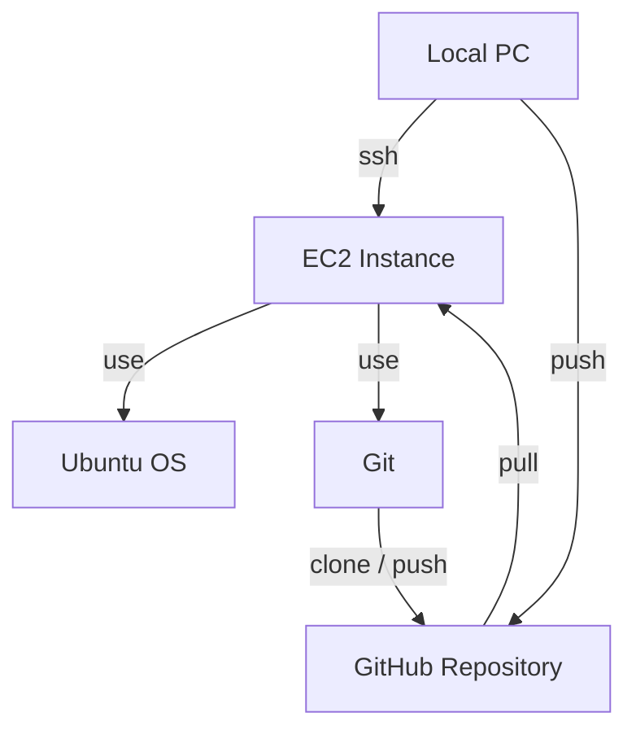

# 【入門】AWS EC2で始める本番環境構築とGitHub連携

## リード文

ローカル環境での開発に慣れてきたら、次のステップは **本番環境へのデプロイ** です。
本記事では、無料枠を利用できる **Amazon Web Services（AWS）** の **EC2** を使い、クラウド上に仮想マシンを立ち上げ、GitHub と連携してコードを操作できる状態を作るところまでを解説します。

「クラウド VM に SSH 接続する」「本番環境で Git を使う」という一連の流れを、手を動かしながら理解していきましょう。

---

## 前提知識

* Linux / ターミナルの基本操作（`ls`, `cd`, `touch` など）
* Git の基本操作（`clone`, `add`, `commit`, `push`）
* GitHub アカウントを持っていること

---

## Context：EC2とは何か？

**EC2（Elastic Compute Cloud）** は、AWS が提供するクラウド上の仮想サーバサービスです。
物理的なサーバを自分で用意・管理することなく、以下のようなことが可能になります。

* 仮想マシン（インスタンス）を数分で作成
* OS（Ubuntu など）を自由に選択
* 必要に応じてスケールアップ / ダウン
* SSH を使ってリモート操作

「クラウド上にある自分専用の Linux マシン」と考えるとイメージしやすいでしょう。

---

## Core Concept：本番環境構築の全体像

今回やることを整理すると、次の5ステップです。

1. EC2 利用のためのアカウント・鍵ペア設定
2. 仮想マシン（インスタンス）の作成
3. SSH によるインスタンス接続
4. 本番環境での Git / GitHub 設定
5. 実際に GitHub と通信できるか確認

---

## 実装例①：EC2のアカウント設定（Step1）

### 鍵ペアとセキュリティグループ

EC2 を使うには、**SSH 接続用の鍵ペア** と **セキュリティグループ** の設定が必要です。

* **鍵ペア**

  * EC2 作成時に使用する秘密鍵（`.pem` ファイル）
  * ローカルにダウンロードし、安全に保管する

* **セキュリティグループ**

  * 仮想ファイアウォールの役割
  * 今回は以下を許可

    * HTTP：80
    * HTTPS：443
    * SSH：22（全 IP 許可 ※学習用途のため）

`.pem` ファイルは、以下のように権限を設定します。

```bash
chmod 400 key-pair-name.pem
```

> `400` は「所有者のみ読み取り可」を意味します。

詳細手順は AWS 公式ガイドを参照してください。
[https://docs.aws.amazon.com/AWSEC2/latest/UserGuide/get-set-up-for-amazon-ec2.html](https://docs.aws.amazon.com/AWSEC2/latest/UserGuide/get-set-up-for-amazon-ec2.html)

---

## 実装例②：EC2インスタンスの作成（Step2）


EC2 コンソールから「インスタンスを起動」を選択し、以下を設定します。

* OS：Ubuntu（最新版）
* インスタンスタイプ：デフォルト（無料枠）
* キーペア：Step1 で作成したもの
* セキュリティグループ：HTTP / HTTPS / SSH 許可
* ストレージ：20GB（無料枠内）

公式ガイド（Step1）
[https://docs.aws.amazon.com/AWSEC2/latest/UserGuide/EC2_GetStarted.html](https://docs.aws.amazon.com/AWSEC2/latest/UserGuide/EC2_GetStarted.html)

---

## 実装例③：SSHでインスタンスに接続（Step3）


インスタンス作成後、SSH で接続します。

```bash
ssh -i /path/key-pair-name.pem ubuntu@public-ip-address
```

* Ubuntu のデフォルトユーザー名は `ubuntu`
* `public-ip-address` は EC2 コンソールから確認

SSH は、暗号化された安全なリモート接続を提供する仕組みです。

公式ドキュメント
[https://docs.aws.amazon.com/AWSEC2/latest/UserGuide/AccessingInstancesLinux.html](https://docs.aws.amazon.com/AWSEC2/latest/UserGuide/AccessingInstancesLinux.html)

---

## 実装例④：本番環境での GitHub 連携（Step4）

### GitHub CLI（gh）の導入

EC2 上では GUI が使えないため、**GitHub CLI（gh）** を利用します。

```bash
sudo apt update
sudo apt install gh
```

インストール手順
[https://github.com/cli/cli/blob/trunk/docs/install_linux.md](https://github.com/cli/cli/blob/trunk/docs/install_linux.md)

---

### SSHキーの生成と認証

```bash
ssh-keygen -t ed25519 -C "your_email@example.com"
eval "$(ssh-agent -s)"
ssh-add ~/.ssh/id_ed25519
```

その後、gh で認証します。

```bash
gh auth login
```

* 認証方式：SSH
* トークンは以下から作成
  [https://github.com/settings/tokens](https://github.com/settings/tokens)

---

### リポジトリをクローン

```bash
git clone git@github.com:{username}/test-html-hello.git
cd test-html-hello
```

---

## 実装例⑤：環境確認（Step5）

本番環境で実際に Git 操作を行います。

```bash
touch goodbye.txt
nano goodbye.txt
```

```text
Goodbye World
```

```bash
git add goodbye.txt
git commit -m "Add goodbye message"
git push
```

GitHub 上で `goodbye.txt` が確認できれば成功です。

---

## 落とし穴・注意点

* `.pem` ファイルの権限設定を忘れると SSH 接続できない
* SSH のユーザー名は OS ごとに異なる（Ubuntu は `ubuntu`）
* Git 初回利用時は必ず `git config --global` を設定する

```bash
git config --global user.name "Your Name"
git config --global user.email "you@example.com"
```

---

## 応用例

* Nginx を導入して静的サイトを公開
* GitHub Actions と連携して自動デプロイ
* セキュリティグループを IP 制限付きに変更

---

## まとめ

* EC2 を使えば無料枠でも本番環境を構築できる
* SSH を使って安全にリモート操作が可能
* 本番環境でも GitHub と連携した開発フローを作れる

この構成をベースに、**「ローカルで開発 → GitHub に push → 本番環境に反映」** という流れで開発を進めていきましょう。

---

## Try It 🚀

* EC2 に Nginx をインストールして HTML を配信してみる
* `.env` を使った環境変数管理に挑戦する
* デプロイスクリプトを Bash で自動化してみる

---

## 全体構成（mermaid）



---

